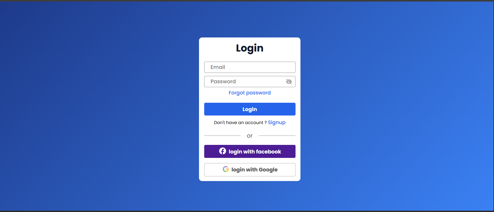
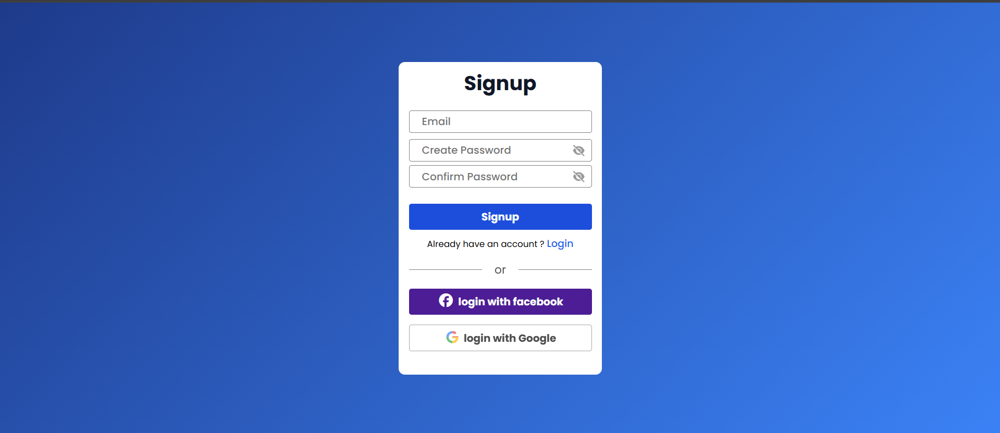

# 🔐 Login & Signup Form (HTML, CSS, JavaScript)

[](https://roshan0011830.github.io/login-signup-ui/)
[](https://github.com/roshan0011830/login-signup-ui)

A clean, responsive **Login and Signup UI** built using **pure HTML, CSS, and JavaScript**.  
This project includes both login and signup pages with a working **password show/hide (eye icon)** feature.  
Perfect for practicing form layouts, modern color gradients, and UI consistency.

---

## 🚀 Project Overview

- **Project Name:** Login & Signup UI  
- **Author:** Roshan Pal  
- **Tech Used:** HTML • CSS • JavaScript  
- **Type:** Frontend UI Project (Static)  
- **Purpose:** Practicing form design, UI polish, and input interactivity.

This project was built as part of my daily frontend roadmap to strengthen HTML-CSS form design and UI logic handling in JavaScript.

---

## ✨ Features

✅ Modern gradient background  
✅ Fully responsive (works on all devices)  
✅ Password toggle using eye icon  
✅ Smooth hover effects on buttons  
✅ Clean typography with Poppins font  
✅ Simple navigation between Login & Signup pages  

---

## 📸 Screenshots

### 🧾 Login Page


### 🧾 Signup Page


> 💡 Add your actual screenshots in the `assets/images/` folder and name them accordingly.

---


## 🧠 What I Learned

- How to structure and style forms using HTML + CSS  
- Creating reusable input designs with focus and hover states  
- Using gradients for elegant backgrounds  
- DOM manipulation in JavaScript to toggle password visibility  
- Keeping the UI consistent between multiple pages  

---

## 🛠 How to Run

1. Clone the repository:
   ```bash
   git clone https://github.com/roshan0011830/login-signup-ui.git
   cd login-signup-ui


